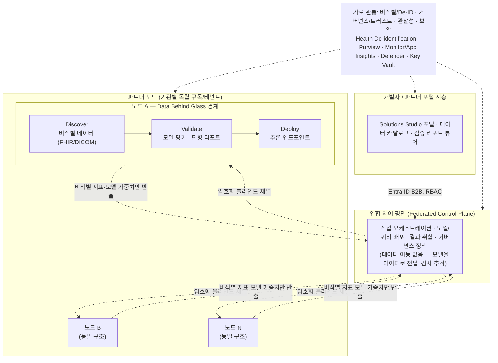
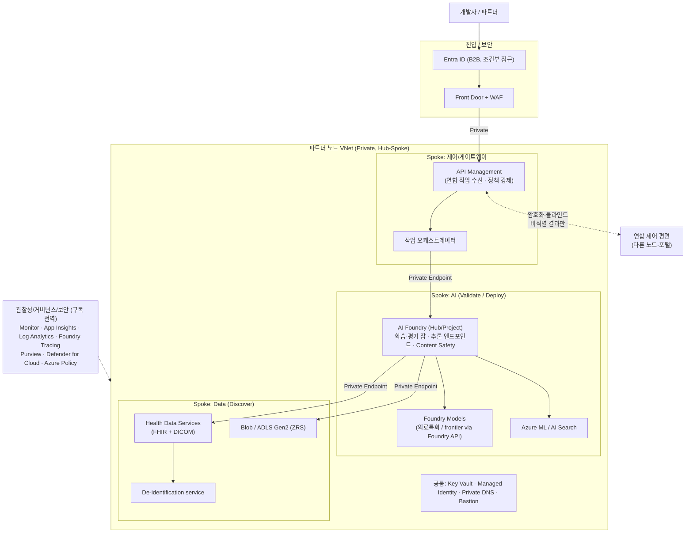

# 아키텍처 다이어그램 (Mermaid)

[← 케이스 스터디 본문](./README.md)의 ASCII 다이어그램을 GitHub 렌더링용 Mermaid로 옮긴 것.

## 논리 아키텍처 (Logical) — 연합 "Data Behind Glass"

```mermaid
flowchart TB
    subgraph P["개발자 / 파트너 포털 계층"]
        UI["Solutions Studio 포털 · 데이터 카탈로그 · 검증 리포트 뷰어"]
    end

    subgraph CP["연합 제어 평면 (Federated Control Plane)"]
        CTRL["작업 오케스트레이션 · 모델/쿼리 배포 · 결과 취합 · 거버넌스 정책<br/>(데이터 이동 없음 — 모델을 데이터로 전달, 감사 추적)"]
    end

    subgraph NODES["파트너 노드 (기관별 독립 구독/테넌트)"]
        direction LR
        subgraph NA["노드 A — Data Behind Glass 경계"]
            DIS["Discover<br/>비식별 데이터 (FHIR/DICOM)"]
            VAL["Validate<br/>모델 평가 · 편향 리포트"]
            DEP["Deploy<br/>추론 엔드포인트"]
            DIS --> VAL --> DEP
        end
        NB["노드 B<br/>(동일 구조)"]
        NN["노드 N<br/>(동일 구조)"]
    end

    UI -->|Entra ID B2B, RBAC| CTRL
    CTRL -.->|암호화·블라인드 채널| NA & NB & NN
    NA & NB & NN -.->|비식별 지표·모델 가중치만 반출| CTRL

    X["가로 관통: 비식별/De-ID · 거버넌스/트러스트 · 관찰성 · 보안<br/>Health De-identification · Purview · Monitor/App Insights · Defender · Key Vault"]
    X -.-> P & CP & NODES
```

## 물리 아키텍처 (Physical) — 파트너 노드 1곳 매핑

```mermaid
flowchart TB
    Dev["개발자 / 파트너"]

    subgraph Edge["진입 / 보안"]
        ENTRA["Entra ID (B2B, 조건부 접근)"]
        FD["Front Door + WAF"]
    end

    subgraph VNet["파트너 노드 VNet (Private, Hub-Spoke)"]
        subgraph SCtrl["Spoke: 제어/게이트웨이"]
            APIM["API Management<br/>(연합 작업 수신 · 정책 강제)"]
            ORCH["작업 오케스트레이터"]
        end
        subgraph SAI["Spoke: AI (Validate / Deploy)"]
            FOUNDRY["AI Foundry (Hub/Project)<br/>학습·평가 잡 · 추론 엔드포인트 · Content Safety"]
            MODELS["Foundry Models<br/>(의료특화 / frontier via Foundry API)"]
            MLSRCH["Azure ML / AI Search"]
        end
        subgraph SData["Spoke: Data (Discover)"]
            HDS["Health Data Services<br/>(FHIR + DICOM)"]
            DEID["De-identification service"]
            BLOB["Blob / ADLS Gen2 (ZRS)"]
        end
        COMMON["공통: Key Vault · Managed Identity · Private DNS · Bastion"]
    end

    CP["연합 제어 평면<br/>(다른 노드·포털)"]
    OBS["관찰성/거버넌스/보안 (구독 전역)<br/>Monitor · App Insights · Log Analytics · Foundry Tracing<br/>Purview · Defender for Cloud · Azure Policy"]

    Dev --> ENTRA --> FD
    FD -->|Private| APIM --> ORCH
    ORCH -->|Private Endpoint| FOUNDRY
    FOUNDRY --> MODELS & MLSRCH
    FOUNDRY -->|Private Endpoint| HDS & BLOB
    HDS --> DEID
    APIM <-.->|암호화·블라인드<br/>비식별 결과만| CP
    OBS -.-> VNet
```
