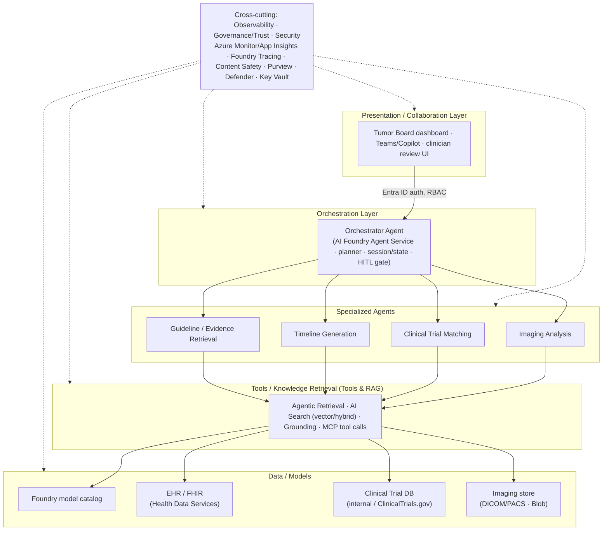
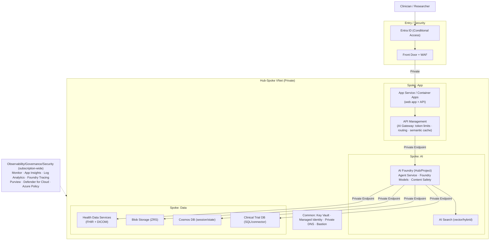

# Architecture Diagrams (Mermaid)

GitHub-renderable Mermaid version of the ASCII diagrams in the [← case study](./README.en.md).

> Korean version: [ARCHITECTURE.md](./ARCHITECTURE.md)

## Logical Architecture

## Physical Architecture

