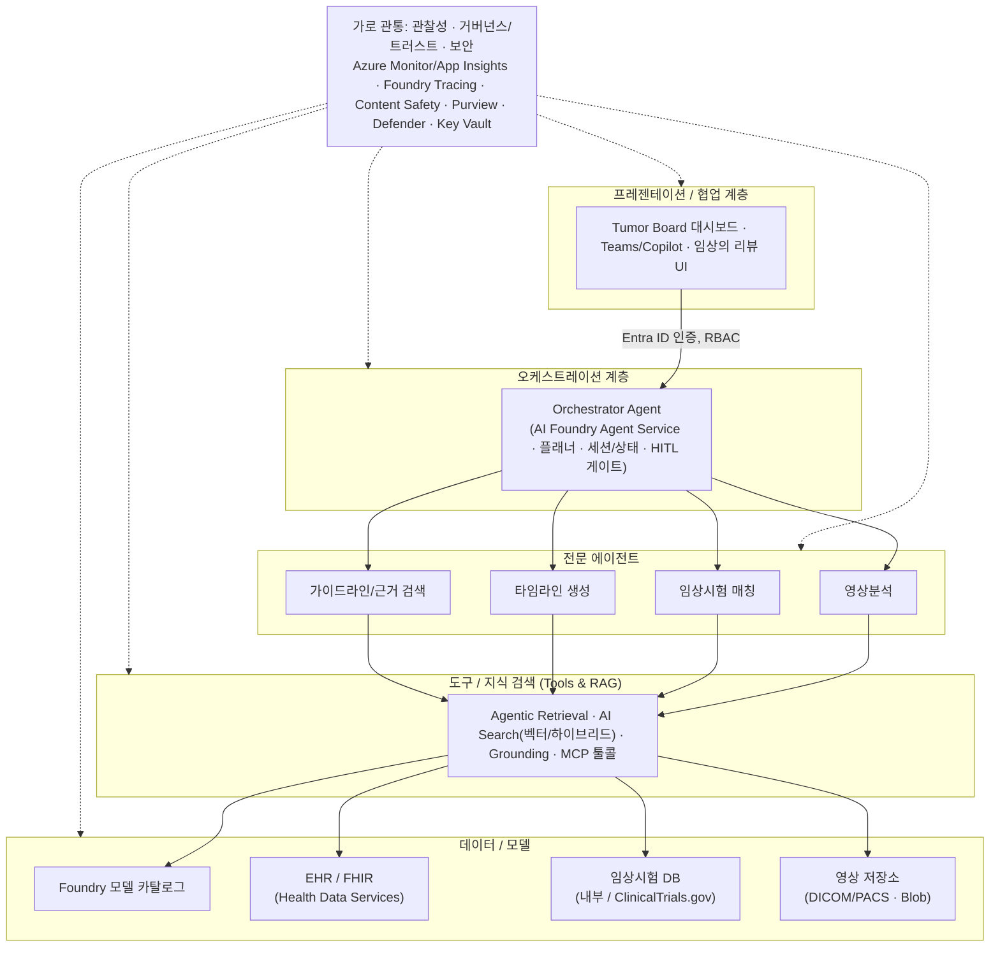
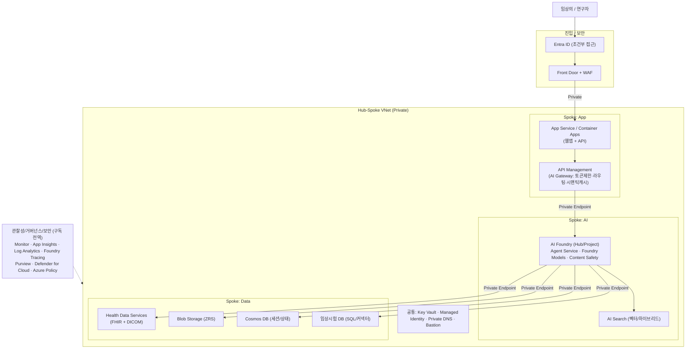

# 아키텍처 다이어그램 (Mermaid)

[← 케이스 스터디 본문](./README.md)의 ASCII 다이어그램을 GitHub 렌더링용 Mermaid로 옮긴 것.

## 논리 아키텍처 (Logical)

```mermaid
flowchart TB
    subgraph P["프레젠테이션 / 협업 계층"]
        UI["Tumor Board 대시보드 · Teams/Copilot · 임상의 리뷰 UI"]
    end

    subgraph O["오케스트레이션 계층"]
        ORCH["Orchestrator Agent<br/>(AI Foundry Agent Service · 플래너 · 세션/상태 · HITL 게이트)"]
    end

    subgraph A["전문 에이전트"]
        A1["영상분석"]
        A2["임상시험 매칭"]
        A3["타임라인 생성"]
        A4["가이드라인/근거 검색"]
    end

    subgraph T["도구 / 지식 검색 (Tools & RAG)"]
        RAG["Agentic Retrieval · AI Search(벡터/하이브리드) · Grounding · MCP 툴콜"]
    end

    subgraph D["데이터 / 모델"]
        M["Foundry 모델 카탈로그"]
        EHR["EHR / FHIR<br/>(Health Data Services)"]
        CT["임상시험 DB<br/>(내부 / ClinicalTrials.gov)"]
        IMG["영상 저장소<br/>(DICOM/PACS · Blob)"]
    end

    UI -->|Entra ID 인증, RBAC| ORCH
    ORCH --> A1 & A2 & A3 & A4
    A1 & A2 & A3 & A4 --> RAG
    RAG --> M & EHR & CT & IMG

    X["가로 관통: 관찰성 · 거버넌스/트러스트 · 보안<br/>Azure Monitor/App Insights · Foundry Tracing · Content Safety · Purview · Defender · Key Vault"]
    X -.-> P & O & A & T & D
```

## 물리 아키텍처 (Physical)

```mermaid
flowchart TB
    User["임상의 / 연구자"]

    subgraph Edge["진입 / 보안"]
        ENTRA["Entra ID (조건부 접근)"]
        FD["Front Door + WAF"]
    end

    subgraph VNet["Hub-Spoke VNet (Private)"]
        subgraph SApp["Spoke: App"]
            APP["App Service / Container Apps<br/>(웹앱 + API)"]
            APIM["API Management<br/>(AI Gateway: 토큰제한·라우팅·시맨틱캐시)"]
        end
        subgraph SAI["Spoke: AI"]
            FOUNDRY["AI Foundry (Hub/Project)<br/>Agent Service · Foundry Models · Content Safety"]
            SEARCH["AI Search (벡터/하이브리드)"]
        end
        subgraph SData["Spoke: Data"]
            HDS["Health Data Services<br/>(FHIR + DICOM)"]
            BLOB["Blob Storage (ZRS)"]
            COSMOS["Cosmos DB (세션/상태)"]
            CTDB["임상시험 DB (SQL/커넥터)"]
        end
        COMMON["공통: Key Vault · Managed Identity · Private DNS · Bastion"]
    end

    OBS["관찰성/거버넌스/보안 (구독 전역)<br/>Monitor · App Insights · Log Analytics · Foundry Tracing<br/>Purview · Defender for Cloud · Azure Policy"]

    User --> ENTRA --> FD
    FD -->|Private| APP
    APP --> APIM -->|Private Endpoint| FOUNDRY
    FOUNDRY --> SEARCH
    FOUNDRY -->|Private Endpoint| HDS & BLOB & COSMOS & CTDB
    OBS -.-> VNet
```
