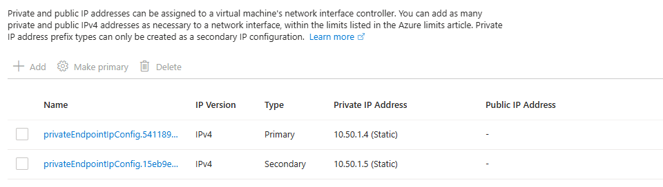
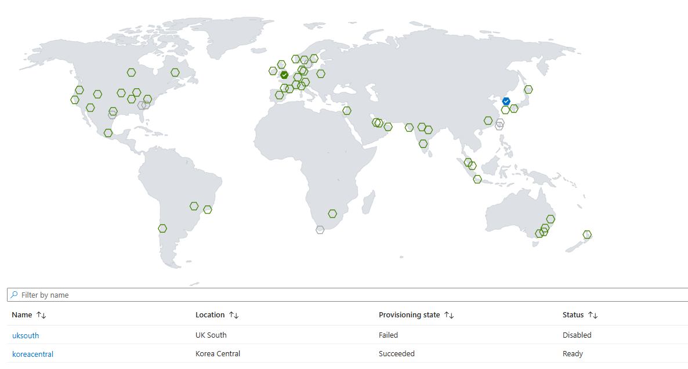

# Private ACR Geo-replication 생성 실패 진단 체크리스트

> 증상: Private Endpoint 기반 ACR에 신규 리전(UK South) replica 생성 시 실패
> 최종 확정 원인: **기존 PE에 신규 data endpoint를 자동 확장하는 단계 실패**
> (`BadRequest: Failed to replicate private endpoint`)

본 문서는 위 증상에 대해 실제로 수행한 진단 절차와, 동일·유사 사례 재발 시
순서대로 점검할 체크리스트를 정리합니다. 명령의 `{acr명}`, `{rg명}`,
`{pe명}` 등은 대상 환경 값으로 치환하여 사용합니다.

---

## 0. 핵심 결론 요약

- [x] private + geo-replication 구성 **자체는 정상 동작**(테스트 환경에서 재현 성공).
- [x] **차단성 원인(정책 Deny / RBAC 403 / Deny Assignment / 위치 제한)은 배제** — Activity Log에서 `write`가 `Accepted → Creating → Failed`로 진행(어드미션 통과).
- [x] **CMK 암호화 배제** (`encryption.status = disabled`).
- [x] **PE 서브넷 IP 고갈 배제** (`/26`, 24/59 사용 → 35 여유). replica 추가는 PE에 ipconfig 1개만 더함.
- [x] **존 중복성(zoneRedundancy) 단독 원인 배제** — `--zone-redundancy Disabled`로도 실패(에러만 더 구체화됨).
- [x] **중앙 DNS Zone의 리소스 Lock 단독 원인 배제** — DNS Zone 영역 Lock을 **해제한 뒤에도 동일하게 실패**.
      → 차단요인(Lock)이 아니라 PE 자동 확장 경로 자체가 깨진 케이스(6단계 점검 후 7~8장으로 진행).
- [x] **최종 원인 확정**: 기존 PE(`{pe명}`)에 신규 `*.uksouth.data.azurecr.io`
      엔드포인트(ipconfig + 사설 IP + A레코드)를 자동 추가하는 "PE replicate" 단계 실패.

---

## 0-1. 진단 원리 (왜 이 순서로 검증하는가)

진단 중 가설이 두 번 바뀌었고, 그 경험에서 나온 "검증 순서의 근거"를 먼저 정리합니다.
이 원리를 이해하면 각 단계가 **무엇을 배제/확정하기 위한 것인지** 명확해집니다.

- **(A) Control-plane vs Data-plane을 먼저 가른다.**
  - replica의 `provisioningState = Failed`는 **control-plane(프로비저닝)** 실패다.
  - **DNS A레코드 누락은 data-plane(pull) 문제**라서, 생성은 성공한 *뒤* "pull 실패"로 나타난다.
    → 따라서 "DNS 레코드가 없어서 `Failed`가 됐다"는 가설은 1차 원인이 될 수 없다(초기 오판 정정).
  - 이 때문에 1단계에서 **Activity Log의 `write`/`Failed` inner error**부터 확보한다.
    상태가 `Accepted → Creating → Failed`면 어드미션은 통과(정책/RBAC 아님), 백엔드 프로비저닝에서 깨진 것.

- **(B) 차단성 원인(정책/RBAC/Lock)부터 배제하고, 구성 변수를 하나씩 분리한다.**
  - 차단성 원인이면 `403/Forbidden`·`disallowed by policy`로 찍힌다. 그렇지 않으면 백엔드 실패다.
  - 그 다음 존중복·리전·네트워크 등 변수를 **단일 변수 분리 테스트(4단계)**로 하나씩 제거해
    재현 가능한 최소 원인을 남긴다.

- **(C) ACR Private Link 구조를 전제로 PE 단계를 본다.**
  - ACR은 **레지스트리당 PE 1개**가 registry endpoint + **모든 리전의 data endpoint를 한 NIC에서** 커버한다.
    리전마다 별도 PE가 필요하지 않다(→ "신규 리전에 PE가 없어서"는 원인이 아님, 초기 오판 정정).
  - 신규 리전 추가 = 기존 PE NIC에 **`*.<region>.data` ipconfig + 사설 IP + A레코드를 자동 확장**.
    이 "PE replicate" 단계가 깨지면 `Failed`가 된다 → 5단계가 최종 원인 영역인 이유.

---

## 1. 에러 1차 분류 (Activity Log)

> **왜 검증?** 포털/Terraform이 보여주는 `ResourceOperationFailure`("터미널 프로비저닝 상태가 Failed")는
> **상위 래퍼 메시지**라 근본 원인이 가려진다. 같은 `correlationId`로 묶인 `write` 이벤트의 inner error를
> 봐야 control-plane 통과 여부와 실제 실패 지점을 알 수 있다. (포털이 찍는 `replications/read`(status `Creating`)는
> 단순 폴링 조회 이벤트이므로 원인이 아니다 — `write`/`Failed` 행만 본다.)

- [ ] correlationId로 중첩(child) 이벤트의 실제 상태 흐름 확인
  ```bash
  az monitor activity-log list --correlation-id <correlationId> \
    --query "[].{op:operationName.value, status:status.value, sub:subStatus.value, msg:properties.statusMessage}" -o jsonc
  ```
  - 판정: `write`가 **Accepted/Created → Creating → Failed** 이면
    → 어드미션 통과 = **정책/RBAC/Deny Assignment/위치제한 원인 아님**(백엔드 프로비저닝 실패).
  - 주의: Activity Log 보존 **90일** — 실패 직후 수집해야 함.

---

## 2. 레지스트리 구성 확인 (차단·구성 요인 배제)

> **왜 검증?** 백엔드 프로비저닝 실패로 좁혀졌으니, 이제 레지스트리 자체 구성에서
> 실패를 유발할 수 있는 변수(CMK 암호화, SKU, 존중복, 네트워크 접근)를 **한 번에 스냅샷**으로 기록해
> 이후 가설(3~5단계)의 기준값으로 쓴다. 특히 `dataEndpointEnabled`가 꺼져 있으면
> 신규 리전 data endpoint 생성 로직과 충돌할 수 있어 우선 확인 대상이다.

- [ ] 암호화/아이덴티티/존중복/네트워크/SKU 일괄 확인
  ```bash
  az acr show -n {acr명} \
    --query "{encryption:encryption, identity:identity, zoneRedundancy:zoneRedundancy, dataEndpointEnabled:dataEndpointEnabled, publicNetworkAccess:publicNetworkAccess, networkRuleBypass:networkRuleBypassOptions, sku:sku.name}" -o jsonc
  ```
  - [ ] `encryption.status` = `disabled` → CMK 원인 배제 (enabled면 Key Vault 방화벽/권한 추가 점검).
  - [ ] `sku` = `Premium` (Private Link/Geo-replication 전제).
  - [ ] `dataEndpointEnabled` 값 기록 — data endpoint가 꺼져 있으면 켜고 재시도(신규 리전 endpoint 생성 전제).
  - [ ] `publicNetworkAccess`, `networkRuleBypassOptions` 값 기록(후속 가설용).
  - [ ] `zoneRedundancy` 값 기록(홈 리전 기준).

---

## 3. 리전/존 지원 여부 확인 (존 중복 가설 점검)

> **왜 검증?** 홈 리전이 존 중복(ZR)인데 대상 리전이 ZR을 지원하지 않거나 capacity가 부족하면
> 프로비저닝이 `Failed`로 떨어질 수 있다. 먼저 **대상 리전의 AZ 노출 여부**를 확인해
> "AZ 미지원" 가설을 싸게 배제한 뒤, 남은 capacity 문제는 4단계 생성 시도로만 확인 가능함을 명시한다.

- [ ] 대상 리전 AZ 지원 여부 (구독 노출 기준)
  ```bash
  SUB=$(az account show --query id -o tsv)
  az rest --method get \
    --url "https://management.azure.com/subscriptions/$SUB/locations?api-version=2022-12-01" \
    --query "value[?name=='uksouth'].availabilityZoneMappings" -o jsonc
  ```
  - 판정: `logicalZone` 1/2/3 이 모두 나오면 **3 AZ 사용 가능** → "AZ 미지원" 배제.
- [ ] (참고) ACR은 리소스 공급자에 `zoneMappings`를 채우지 않음 → 위 리전 AZ API가 표준 확인법.
- [ ] 실제 존 중복 할당 capacity는 **사전 조회 불가** → 생성 시도(4단계) 또는 지원티켓으로만 확인.

---

## 4. 단일 변수 분리 테스트 (CLI 직접 생성 — 에러 상세 확보)

> **왜 검증?** 원인 후보(존중복·리전 종속·PE 구조)를 **한 번에 하나씩만 바꿔** 재현해야
> 어느 변수가 실패를 만드는지 확정할 수 있다. 존중복을 끄고도 실패하면 ZR 단독 원인이 아니고,
> 에러가 `Failed to replicate private endpoint`로 **구체화**되면 PE 단계(5단계)로 좁혀진다.
> 다른 리전(japaneast 등)으로도 실패하면 리전 고유 문제가 아니라 **PVL 구조적 문제**임을 가른다.

> 포털의 Replications 지도(map) 추가는 존 중복 토글을 노출하지 않으므로 CLI 사용.
> Terraform은 상세 사유를 삼키므로 **원인 규명 단계에서는 CLI 직접 생성** 권장.

- [ ] 존 중복 끄고 생성(단일 변수 분리)
  ```bash
  az acr replication create -r {acr명} -l uksouth --zone-redundancy Disabled -o jsonc
  ```
  - 성공 → 존 중복 프로비저닝(capacity)이 원인.
  - 실패하되 **에러가 구체화**되면(예: `Failed to replicate private endpoint`) → 5단계로.
- [ ] (옵션) 다른 리전으로 생성하여 리전 고유 문제인지 분리
  ```bash
  az acr replication create -r {acr명} -l japaneast -o jsonc
  ```
- [ ] 상세 로그 캡처
  ```bash
  az acr replication create -r {acr명} -l uksouth --zone-redundancy Disabled --debug 2>&1 | tail -50
  ```

---

## 5. Private Endpoint 복제 실패 정밀 진단 (최종 원인 영역)

> **왜 검증?** ACR은 PE 1개가 모든 리전 data endpoint를 한 NIC에서 커버하므로(0-1 (C) 참조),
> 신규 리전 추가는 **기존 PE NIC에 `*.<region>.data` ipconfig + 사설 IP + A레코드를 자동 확장**하는 단계다.
> 이 단계를 막는 요인 — PE 연결 비정상, IP 고갈, 리소스 Lock, 서브넷 PE 네트워크 정책,
> **타 구독 중앙 DNS Zone Group 자동 갱신 권한 부재**, 그리고 **PE의 Static IP 할당(→ 7장)** — 를 하나씩 점검해 차단 지점을 찾는다.

> 에러 `Failed to replicate private endpoint` = 기존 PE에 신규 리전 data endpoint를
> 끼워넣는 단계 실패. 아래로 PE 상태/구성/차단요인을 점검.

### 5-1. PE DNS configuration에 zone group이 안 보일 때

증상: Private DNS Zone에 VNet Link는 했는데, Private Endpoint의 **DNS configuration**에
연결된 zone group 구성 정보가 표시되지 않고 이름 해석이 안 됨.

원인: **VNet Link ≠ Zone Group**. 둘은 역할이 다르다.

| 구성 | 역할 | 이 항목만으로 A 레코드가 생기나? |
| --- | --- | --- |
| VNet Link (`...virtual_network_link`) | zone을 VNet에 연결해 **조회 가능**하게 함 | ❌ 아니오 |
| Zone Group (`private_dns_zone_group`) | PE 사설 IP를 zone에 **A 레코드로 등록**, PE의 DNS configuration에 표시 | ✅ 예 |

즉 VNet Link만 있으면 "조회할 zone은 연결됐으나 그 안에 ACR 레코드가 없는" 상태다.
A 레코드는 (1) PE의 zone group, 또는 (2) 중앙 Azure Policy(DeployIfNotExists)가 만들어야 한다.

해결: `infra/application/terraform.tfvars`에서 zone group을 생성하도록 설정 후 `terraform apply`.

```hcl
use_central_dns_zone_group      = true
central_dns_subscription_id     = "{중앙 DNS 구독 ID}"
central_dns_resource_group_name = "{중앙 DNS zone이 있는 RG}"
central_private_dns_zone_name   = "privatelink.azurecr.io"
```

> 중앙 zone에 대한 **Private DNS Zone Contributor** 권한이 필요하다.
> 중앙에 자동 등록 Policy가 운영 중이라면 이 설정 없이도 Policy가 zone group을 붙여준다.

- [ ] PE 연결 상태 점검 (Approved/Succeeded 여부)
  ```bash
  az acr private-endpoint-connection list -r {acr명} \
    --query "[].{name:name, status:privateLinkServiceConnectionState.status, provState:provisioningState, desc:privateLinkServiceConnectionState.description}" -o table
  ```
  - 비정상(Pending/Rejected/Disconnected/Failed) 발견 시 → 해당 연결 정리/재승인 후 재시도.
- [ ] PE의 현재 FQDN ↔ IP 매핑 확인 (data endpoint 개수)
  ```bash
  PEID=$(az acr private-endpoint-connection list -r {acr명} --query "[0].privateEndpoint.id" -o tsv)
  az network private-endpoint show --ids "$PEID" \
    --query "customDnsConfigs[].{fqdn:fqdn, ips:ipAddresses}" -o jsonc
  ```
  - 기대: `azurecr.io` + `<home>.data.azurecr.io` 만 존재(신규 `*.uksouth.data` 누락 = 추가 실패 흔적).
- [x] **리소스 잠금(Lock)** 으로 NIC/PE 수정 차단 여부
  ```bash
  az lock list -g {rg명} -o table
  # 중앙 DNS Zone이 위치한 RG/구독에 대해서도 동일 확인
  ```
  - **결과(본 사례)**: 중앙 DNS Zone 영역의 Lock을 **해제 후 재시도했으나 동일 실패** → Lock은 원인 아님(배제).
    Lock을 풀어도 실패하면 차단요인이 아니라 **PE 자동 확장 경로 자체의 문제**이므로, 아래
    DNS Zone Group 권한(이 섹션 마지막 항목)을 먼저 확인하고 7~8장으로 진행한다.
- [ ] **서브넷 PE 네트워크 정책** 으로 ipconfig 추가 차단 여부
  ```bash
  SUBNET_ID="/subscriptions/<sub>/resourceGroups/{rg명}/providers/Microsoft.Network/virtualNetworks/{vnet명}/subnets/{subnet명}"
  az network vnet subnet show --ids "$SUBNET_ID" \
    --query "{pe:privateEndpointNetworkPolicies, pls:privateLinkServiceNetworkPolicies}" -o jsonc
  ```
- [ ] **중앙(cross-subscription) DNS Zone Group 자동 갱신 권한** 확인
  - PE의 DNS Zone Group이 다른 구독(예: `prd-sub-rb-krc`)의 `privatelink.azurecr.io`를 가리키는 경우,
    신규 A레코드(`*.uksouth.data`) 자동 등록을 위해 해당 구독/zone에 대한
    **Private DNS Zone Contributor** 권한이 필요.

---

## 6. PE IP 할당 방식 / 중앙 Private DNS Zone 잠금 점검

### 6-1. PE IP 할당 방식 점검
- [ ] PE NIC의 ipconfig별 IP 할당 방식 확인
  ```bash
  az network nic show \
    --ids $(az network private-endpoint show -n {pe명} -g {rg명} \
              --query "networkInterfaces[0].id" -o tsv) \
    --query "ipConfigurations[].{Name:name, PrivateIPAddress:privateIPAddress, Alloc:privateIPAllocationMethod}" \
    -o table
  ```
  - [ ] `Alloc`이 `Static`이면 7번(결론)으로 이동한다.
  - [ ] `Alloc`이 `Dynamic`이면 6-2와 6-3을 계속 확인한다.

### 6-2. 중앙 Private DNS Zone 잠금 점검
- [ ] 중앙 DNS RG 잠금 확인
  ```bash
  az lock list --subscription {central-dns-subscription-id} -g {central-dns-rg} -o table
  ```
  - [ ] `CanNotDelete` 잠금이 있으면 제거 후 다시 시도한다.
  - [ ] 잠금이 없으면 6-3과 7번을 계속 확인한다.

### 6-3. `terraform destroy` hang 점검
- [ ] 아래 조건으로 잠금 연계 hang인지 확인
  ```bash
  terraform state show azurerm_container_registry.this | grep -E '^\s+id\s+='
  SUB=<deploy-subscription-id>; RG={rg명}
  az monitor activity-log list --subscription $SUB -g $RG --offset 40m \
    --query "[?status.value=='Failed'].{op:operationName.value, msg:properties.statusMessage}" -o json
  ```
  - [ ] `privateDnsZoneGroups/delete` + `ScopeLocked`면 중앙 DNS 잠금이 직접 원인이다.
  - [ ] 해당 흔적이 없으면 7번 결론과 8번 검증을 계속 확인한다.

---

## 7. 확인된 Limitation — Private Endpoint가 Static IP면 geo-replication 생성 실패

### 7-1. 최종 결론
- [x] PE를 **Static IP**로 구성하면 geo-replication 생성이 실패했다(테스트 재현).
- [x] PE를 **Dynamic IP**로 구성하면 geo-replication 생성이 성공했다(테스트 재현).
- [x] 5~6단계 점검 후에도 실패하면, 이 limitation을 우선 원인으로 본다.

### 7-2. 확인 방법 (Static/Dynamic 판정)
- [ ] PE NIC의 ipconfig별 IP 할당 방식 확인
  ```bash
  az network nic show \
    --ids $(az network private-endpoint show -n {pe명} -g {rg명} \
              --query "networkInterfaces[0].id" -o tsv) \
    --query "ipConfigurations[].{Name:name, PrivateIPAddress:privateIPAddress, Alloc:privateIPAllocationMethod}" \
    -o table
  ```
  - [ ] `Alloc`이 `Static`이면 본 limitation 해당.
  - [ ] `Alloc`이 `Dynamic`이면 5~6단계의 다른 차단요인을 다시 본다.

PE를 Static IP로 구성한 상태에서 신규 리전 replica를 추가하면 PE 자동 확장이 실패하며 replica가 `Failed`가 된다.

| PE를 Static IP로 구성 | 그 상태에서 replication 추가 실패 |
|---|---|
|  |  |

### 7-3. 원리
geo-replication을 생성하면 ACR은 기존 PE NIC에 **ipconfig 1개를 추가**하고, replication 리전의 data endpoint에 사설 IP를 할당한다.
- [ ] Dynamic IP면 서브넷에서 가용 IP를 자동 할당받아 확장된다.
- [ ] Static IP면 새 endpoint용 IP 자동 할당이 불가해 확장 단계가 실패할 수 있다.

### 7-4. 대응 경로
- [ ] PE를 Dynamic IP로 재구성한다.
- [ ] 유지보수 창에서 replica 생성 재시도한다.
- [ ] 필요 시 [PE Dynamic ⇄ Static IP 전환 가이드](./GUIDE-PE-IP-ALLOCATION-SWITCH.md)를 따른다.
- [ ] Static IP가 필수 요구사항이면 8번까지 확인 후 케이스 오픈한다.

---

## 8. 사후 검증 (생성 성공 후)

### 8-1. 확인 방법과 판정 기준
- [ ] replica 상태 확인
  ```bash
  az acr replication list -r {acr명} \
    --query "[].{replica:name, location:location, zoneRedundancy:zoneRedundancy, status:provisioningState}" -o table
  ```
  - [ ] 대상 리전의 `status`가 `Succeeded`(또는 Ready)여야 한다.
- [ ] PE에 신규 data endpoint A레코드 등록 확인(`*.uksouth.data -> 사설 IP`).
- [ ] 대상 리전 워크로드가 로컬 data endpoint로 직접 연결되는지 점검.

실패 시 다음 액션:
- [ ] replica 상태가 실패면 5단계로 복귀.
- [ ] A레코드/연결 경로 미완성이면 5-1 또는 6-2 경로를 다시 점검.
