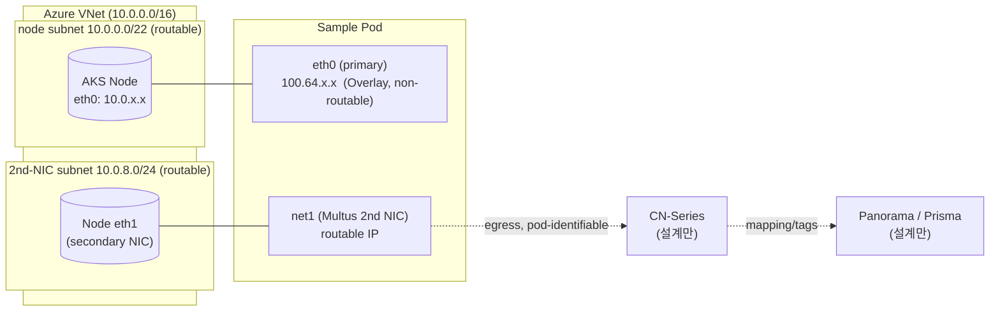
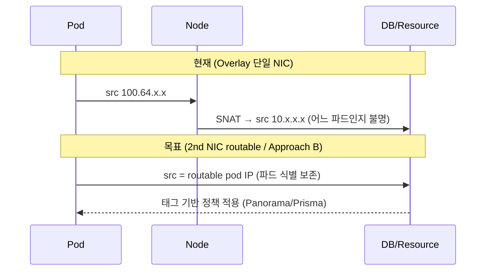
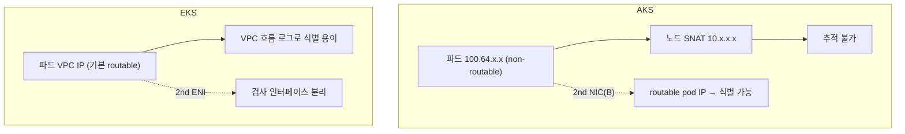

# AKS Multi-NIC (Multus) for CN-Series — 설계 문서

> 상태: 설계(Design) / PoC 대상
> 최종 산출물: 본 설계 문서 + 배포 가능한 Terraform IaC PoC (AKS + Multus + 샘플 파드 2nd NIC)
> CN-Series / Panorama / Prisma: **설계만** (실배포 제외 — 라이선스·이미지·Panorama 필요)

## 1. 배경 / 비즈니스 컨텍스트

BHP는 AKS에서 **Dual NIC**(파드당 2개 이상의 네트워크 인터페이스)를 요구한다. 목적은
Palo Alto **CN-Series**(컨테이너형 차세대 방화벽)를 Kubernetes 서비스로 배포하여
트래픽 검사/라우팅을 수행하고, 이를 **Panorama / Prisma Cloud**로 연동하는 것이다.

CN-Series 공식 배포 가이드:
<https://docs.paloaltonetworks.com/pan-os/10-1/pan-os-new-features/virtualization-features/deploy-the-cn-series-as-a-kubernetes-service>
Multus CNI: <https://github.com/k8snetworkplumbingwg/multus-cni>
Prisma Cloud: <https://www.paloaltonetworks.com/prisma/cloud>

### 근본 문제 (Why a 2nd NIC)

현재 AKS는 **Azure CNI Overlay**를 사용한다.

| 구성요소 | 대역 | 라우팅 |
| --- | --- | --- |
| Pod (primary NIC) | `100.64.0.0/16` (CGNAT) | **non-routable** |
| Node | `10.x.x.x/22` | routable (private) |
| Control plane traffic | 별도 NIC 경유 | routed |

파드가 클러스터 밖(예: DB)으로 나갈 때 소스 주소 `100.64.x.x`는 **노드 IP(`10.x.x.x`)로 SNAT**된다.
그 결과:

- 사이버/네트워크 팀이 **어느 파드가** 네트워크 리소스에 접속하는지 식별할 수 없다.
- 추적성을 위해 `10.x.x.x/22` 전체를 리소스에 열어주는 것은 **수용 불가**(과도한 노출).

Palo Alto의 Panorama/Prisma는 **non-routable 파드 IP ↔ 파드 매핑**을 제공하고
**태그 기반 접근 제어**를 가능하게 한다. 이를 위해 CN-Series 데이터플레인이
**2nd NIC**(검사·라우팅용)를 필요로 한다.

이 기능은 또한 **Managed CaaS 클러스터의 IP 주소 하드 리밋을 제거**하는 기능을 가로막고 있다
(이 플랫폼은 비핵심 애플리케이션을 컨테이너로 운영하는 용도).

## 2. 목표 / 비목표

### 목표
- AKS에서 파드에 **2nd NIC**를 부착하는 기반 기술(Multus)을 **배포 가능한 PoC**로 실증.
- **관리형 Multus 애드온** vs **수동 DaemonSet 설치** 두 경로를 모두 구현하여 trade-off 실증.
- 고객 운영 네트워크 모델(**Azure CNI Overlay + 파드 `100.64.0.0/16` + 노드 `10.x.x.x/22`**)을 그대로 재현.
- 2nd NIC를 **별도 routable 서브넷**으로 연결하는 두 가지 데이터플레인(A: macvlan/ipvlan, B: Azure CNI delegate) 제공.
- **AWS(EKS) 레퍼런스와의 심층 비교**(네트워킹 모델·IPAM·egress 추적·CN-Series 배포 차이).

### 비목표 (YAGNI)
- CN-Series 실제 배포(라이선스/이미지/Panorama 연동) — **설계 스케치만**.
- Prisma Cloud 실제 연동.
- Windows 노드풀(Multus는 Linux 노드 대상).
- 프로덕션 등급 보안 하드닝/멀티리전.

## 3. 목표 아키텍처



- **Primary CNI**: Azure CNI Overlay. 파드 기본 인터페이스 `eth0` = `100.64.0.0/16`.
- **Multus**: 메타-CNI. `NetworkAttachmentDefinition`(NAD)를 파드 어노테이션으로 참조해 `net1` 주입.
- **2nd NIC subnet**: routable `10.0.8.0/24`. 노드는 secondary Azure NIC(`eth1`)를 이 서브넷에 가짐.

## 4. 산출물 레이아웃

```
scenarios/aks-multinic-cn-series/
  DESIGN.md          # 본 문서
  PLAN.md            # 구현 계획 (writing-plans 산출)
  README.md          # 배포/재현/정리 절차
  infra/             # 독립 배포용 Terraform
    providers.tf
    variables.tf
    main.tf          # VNet/서브넷, AKS(Overlay), 노드풀, 관리형 Multus 토글
    outputs.tf
    terraform.tfvars.example
    .gitignore
  k8s/
    multus-daemonset/        # 수동 설치 경로 (upstream manifest/helm values, 버전 고정)
    nad-macvlan.yaml         # Approach A (macvlan/ipvlan, static IPAM)
    nad-azure-delegate.yaml  # Approach B (Azure CNI delegate, routable)
    sample-pod-dualnic.yaml  # 검증용 파드 (net1 어노테이션)
    cn-series/               # 설계용 스케치 (주석으로 라이선스/Panorama 표기, apply 비대상)
  scripts/
    verify-dualnic.sh        # 파드 net1 확인 + 추적성 데모
```

## 5. Multus 설치 방식 비교 (둘 다 구현)

### 5.1 관리형 애드온 (Azure-managed, preview)
- 활성화: 기본 `az` CLI에는 플래그가 없다. **`aks-preview` 확장 + `EnableManagedMultus` 기능 등록 +
  `--enable-managed-multus`** 가 필요하며, `--network-plugin none` 을 요구할 수 있어 **Azure CNI Overlay와 충돌 가능**.
- 장점: Azure가 수명주기 관리.
- 단점/제약: **preview**, 지원 리전·k8s 버전·기능 제약, Overlay 호환성 — 배포 시점 문서 확인 필요(§8).
  본 PoC의 Terraform은 자동 활성화하지 않고 절차만 안내한다(실제 테스트 경로는 §5.2 수동 DaemonSet).

### 5.2 수동 DaemonSet (upstream `multus-cni`)
- 설치: upstream thick/thin plugin DaemonSet(매니페스트/Helm), 이미지 버전 고정.
- 장점: 버전·구성 완전 제어, 다른 K8s(EKS 포함)로 이식성 높음.
- 단점: 운영 부담(업그레이드·호환성 직접 관리).

| 항목 | 관리형 애드온 | 수동 DaemonSet |
| --- | --- | --- |
| 수명주기 | Azure 관리 | 사용자 관리 |
| 버전 제어 | 제한적 | 완전 |
| 이식성 | 낮음(AKS 종속) | 높음 |
| 지원/SLA | Azure 지원 | 커뮤니티 |
| preview 리스크 | 있음 | 없음 |

## 6. 2nd NIC 데이터플레인 접근법

### Approach A — macvlan / ipvlan (static IPAM) — **실제 테스트 가능 경로**
- NAD가 노드 인터페이스 위에 macvlan/ipvlan을 생성해 파드에 `net1`을 부여.
- **중요**: 표준 AKS 관리형 노드풀은 노드에 보조 NIC(`eth1`)를 자동 제공하지 않는다.
  따라서 PoC는 모든 노드에 존재하는 **`master: eth0`** 위에 macvlan을 만들어 `net1` 부착을 실증한다.
- **장점**: stock AKS에서 그대로 동작 — "2nd NIC(net1) 부착" 실증 확실.
- **한계**: macvlan 파드 IP는 **Azure 패브릭 anti-spoofing**에 의해 차단되어
  VNet 관점에서 **routable이 아님**. 즉 "2nd NIC 부착"은 증명되나 "routable 2nd NIC"는 아님
  — 이것이 CN-Series/Approach B가 필요한 이유.

### Approach B — Azure CNI delegate (routable) — **실험적/설계 참조**
- NAD의 delegate를 Azure CNI(azure-vnet/azure-ipam)로 지정, 2nd NIC를 **전용 Azure pod 서브넷**에 연결하는 것을 목표.
- 의도: 파드 2nd NIC가 **Azure가 인지하는 진짜 routable IP**를 획득 → 파드 단위 식별/태그 정책(요구사항 정합).
- **주의(검증 필요, §8)**: azure-vnet을 Multus delegate로 쓰는 것은 표준 문서화된 turnkey 구성이 아니며,
  Overlay(primary) + Azure CNI(delegate) 지원/형식은 **라이브 검증 전까지 동작 보장 안 됨**.
  따라서 본 PoC에서 즉시 테스트 가능한 경로는 Approach A이고, B는 routable 목표를 위한 설계 참조로 둔다.

### Approach C — Multus 미사용 대안 (비교 전용)
- Cilium **egress gateway** / 전용 pod 서브넷 / per-pod SNAT로 NIC 추가 없이 egress 추적.
- **장점**: NIC 추가 불필요, 단순.
- **단점**: CN-Series **인라인 검사** 요구 미충족 → PoC 비대상, 본 문서 비교 섹션에만 기술.

## 7. 데이터 플로우 & 추적성



## 8. 제약 / 검증 항목 (Open Items)

배포 시점에 **현재 공식 문서/실측으로 검증**해야 하는 항목:

1. Azure CNI **Overlay + Multus**(관리형/수동) 호환성 및 지원 매트릭스.
2. **노드 보조 NIC 부재**: 표준 AKS 관리형 노드풀은 노드에 `eth1`을 자동 제공하지 않음 → PoC는 `master: eth0` macvlan으로 `net1` 부착 실증. routable 2nd NIC를 위한 노드 보조 NIC 부착 방안은 별도 검증 필요.
3. **Azure 패브릭 anti-spoofing**으로 인한 Approach A의 라우팅 한계 — A는 net1 부착/검사 실증용, routable 요구는 B(설계 참조).
4. **Overlay primary + Azure CNI delegate(Approach B)** 지원 여부/형식 — azure-vnet을 Multus delegate로 쓰는 것은 표준 turnkey 구성이 아니며 라이브 검증 필요.
5. 관리형 Multus 애드온: 기본 CLI에 플래그 없음 → `aks-preview` + `EnableManagedMultus` 기능 등록 + `--enable-managed-multus`, **지원 리전·k8s 버전·preview 상태 및 `--network-plugin none`(Overlay 충돌) 여부** 검증 필요.
6. 수동 Multus 이미지: `ghcr.io/k8snetworkplumbingwg/multus-cni:v4.1.0-thick` 레지스트리 존재 확인됨(배포 시점 재확인 권장).
7. CN-Series PAN-OS/이미지 버전 호환성(설계 참고): PAN-OS ≥ 10.1.x, Helm 기반 배포, `multus: enable`.

> 검증 방법: 사용자 구독에서 `terraform apply` 후 `scripts/verify-dualnic.sh`로
> 샘플 파드의 `net1` 인터페이스/IP 확인 및 egress 소스 IP 구분 데모.

## 9. AWS(EKS) 심층 비교

### 9.1 네트워킹 모델 / IPAM

| 항목 | Azure AKS | AWS EKS |
| --- | --- | --- |
| Primary CNI | Azure CNI Overlay (파드 `100.64/16`, VXLAN) | Amazon VPC CNI (파드 = VPC ENI/보조 IP) 또는 Overlay(예: Calico) |
| 파드 IP 출처 | Overlay CIDR(클러스터 내부) | 기본은 **VPC 라우터블 IP**(ENI secondary IP) → 종종 IP 고갈 이슈 |
| 2nd NIC 메커니즘 | Multus + macvlan/ipvlan **또는** Azure CNI delegate | Multus + **secondary ENI**(ipvlan/macvlan or aws-cni delegate) |
| 노드 secondary NIC | 추가 Azure NIC(서브넷별) | 추가 **ENI** attach |
| 라우터블 2nd NIC | Approach B(Azure CNI delegate) | secondary ENI는 기본 VPC-routable |

### 9.2 Egress 추적성



- **AKS**: Overlay 때문에 기본적으로 SNAT로 파드 식별 소실 → 2nd NIC(B) 또는 Panorama 매핑 필요.
- **EKS**: VPC CNI는 파드가 기본 VPC-routable IP를 가져 VPC Flow Logs로 식별이 상대적으로 쉬움. 단, IP 고갈/관리 부담이 큼(반대 trade-off).

### 9.3 CN-Series 배포 차이

| 항목 | AKS | EKS |
| --- | --- | --- |
| Multus 제공 | 관리형 애드온 + 수동 | 수동(EKS Multus 가이드/Helm) |
| 2nd 인터페이스 소스 | Azure NIC / Azure CNI delegate | secondary ENI |
| 데이터플레인 모드 | CNF(컨테이너) | CNF(컨테이너) |
| 관리/라이선스 | Panorama 동일 | Panorama 동일 |
| 라우터블성 | Overlay로 추가 작업 필요 | VPC-native로 비교적 자연스러움 |

### 9.4 AKS ↔ EKS 개념 대응표

| 개념 | AKS | EKS |
| --- | --- | --- |
| 가상 네트워크 | VNet / Subnet | VPC / Subnet |
| 노드 보조 인터페이스 | 추가 NIC | 추가 ENI |
| Overlay 파드 대역 | Azure CNI Overlay CIDR | (선택) Calico/기타 overlay |
| 메타-CNI | Multus(관리형/수동) | Multus(수동) |
| egress 추적 보강 | CN-Series + Panorama/Prisma | CN-Series + Panorama/Prisma |

## 10. 테스트 / 검증 기준

- 샘플 파드에 `net1` 인터페이스가 존재(`ip addr`)한다.
- `net1` IP가 지정한 2nd NIC routable 서브넷 대역에 속한다.
- (Approach B) egress 트래픽의 소스 IP가 **파드별로 구분**됨을 데모(추적성).
- 관리형/수동 Multus 두 경로 모두에서 위 검증이 재현된다.
- `README.md`의 정리(destroy) 절차로 리소스가 완전히 삭제된다.

## 11. 참고 링크
- Multus CNI: <https://github.com/k8snetworkplumbingwg/multus-cni>
- CN-Series K8s 배포: <https://docs.paloaltonetworks.com/pan-os/10-1/pan-os-new-features/virtualization-features/deploy-the-cn-series-as-a-kubernetes-service>
- Prisma Cloud: <https://www.paloaltonetworks.com/prisma/cloud>
- CN-Series Helm: <https://github.com/PaloAltoNetworks/cn-series-helm>
