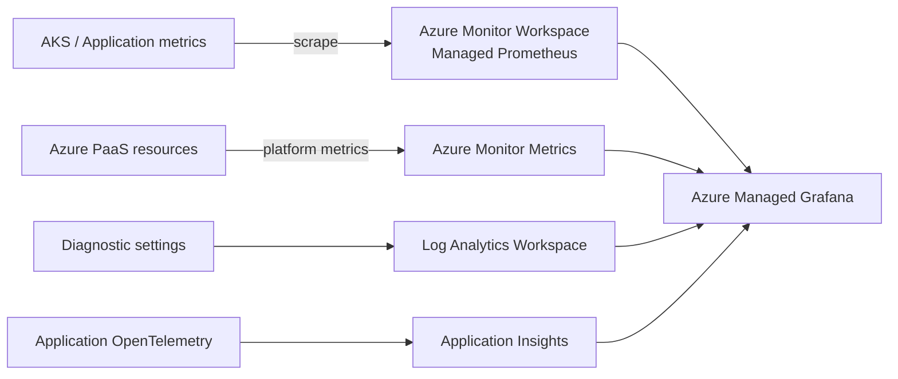

# Azure 인프라 Grafana 모니터링 가이드

Azure Monitor, Log Analytics, Azure Monitor Managed Service for Prometheus를 사용해 Azure 인프라를
Grafana에서 관측하기 위한 운영 Reference다. 서비스별로 **반드시 확인할 신호**, 데이터 소스,
Grafana 구현 방법과 초기 경보 기준을 정리한다.

이 폴더는 실제 Azure 리소스를 배포하지 않는다. 대신 환경에 맞게 import해서 확장할 수 있는
샘플 대시보드를 제공한다.

- 통합 샘플: [`dashboards/azure-infrastructure-overview.json`](./dashboards/azure-infrastructure-overview.json)
- Cosmos DB 상세 샘플: [`dashboards/cosmos-db-details.json`](./dashboards/cosmos-db-details.json)

## 왜 이 위치에 두는가

이 저장소는 배포·검증 가능한 단위를 `scenarios/<이름>/`에 둔다. 모니터링 Reference와 Grafana
JSON은 함께 버전 관리하고 import해서 검증할 수 있으므로 독립 시나리오로 관리한다.

```text
scenarios/azure-grafana-monitoring/
  README.md
  dashboards/
    azure-infrastructure-overview.json
    cosmos-db-details.json
```

## 데이터 흐름



### 데이터 소스 역할

| 데이터 소스 | 사용 목적 | 대표 대상 |
| --- | --- | --- |
| Azure Monitor Metrics | 빠른 상태·성능·용량 신호 | Cosmos DB, Redis, PostgreSQL, AI 서비스, App Gateway, Firewall |
| Log Analytics | 요청 상세, 오류 원인, 감사·보안 이벤트 | 진단 로그, Container Insights, Traffic Analytics |
| Managed Prometheus | Kubernetes 및 앱 메트릭 | AKS node/pod/workload, 앱이 노출하는 Prometheus 메트릭 |
| Application Insights / OpenTelemetry | 사용자 관점 E2E 지연과 호출 의존성 | Container Apps, AKS 앱, AI 호출 체인 |

> Log Analytics와 Prometheus만으로는 충분하지 않다. PaaS의 핵심 신호 중 일부는 Azure Monitor
> Metrics에서만 제공되거나 진단 설정 내보내기를 지원하지 않는다.

## 공통 준비

1. Azure Managed Grafana에 Azure Monitor 데이터 소스를 연결한다.
2. AKS에는 Managed Prometheus를 활성화하고 Azure Monitor Workspace에 연결한다.
3. 각 PaaS 리소스의 Diagnostic settings에서 필요한 로그를 Log Analytics Workspace로 보낸다.
4. Grafana 관리 ID에 대상 범위의 `Monitoring Reader`와 Workspace 쿼리 권한을 부여한다.
5. 대시보드를 import한 뒤 데이터 소스와 템플릿 변수의 placeholder를 실제 환경에서 선택한다.

샘플 JSON에는 구독 ID, 리소스 그룹, 리소스 이름을 저장하지 않는다. import 후 Grafana 변수에
환경 값을 입력한다.

## ① 통합 상태 Overview

Overview는 모든 원천 데이터를 한 화면에 복제하는 대시보드가 아니다. 장애를 발견하고 담당 상세
대시보드로 이동하기 위한 **상태 요약 계층**이다.

| 관점 | 필수 패널 | 판정 예 |
| --- | --- | --- |
| 가용성 | 비정상 리소스, AKS unavailable replica, App Gateway unhealthy backend, DB alive | 정상/주의/위험 |
| 트래픽 | 요청률, 처리량, 토큰·RU 소비 | 현재값과 기준선 비교 |
| 오류 | 5xx, 429, restart, failed connection | 오류율과 건수 병행 |
| 지연 | API p95/p99, DB server latency, LLM TTFT/TTLT | 서비스 SLO와 비교 |
| 포화 | CPU·메모리, RU, PTU, 연결, SNAT, 스토리지 | 제한 대비 백분율 |
| 보안 | WAF block, Firewall deny/IDPS, Content Safety reject | 급증과 상위 원인 |

샘플 Overview에는 AKS, Cosmos DB, PostgreSQL, Redis, Azure OpenAI, App Gateway, Azure Firewall의
대표 신호를 포함한다. 실제 운영에서는 패널 링크로 영역별 상세 대시보드에 연결한다.

## ② APP

### AKS

**반드시 볼 항목**

| 항목 | 이유 | 데이터와 구현 |
| --- | --- | --- |
| Node Ready | NotReady 노드는 Pod를 정상 제공할 수 없음 | Prometheus `kube_node_status_condition` |
| Pending/Unschedulable Pod | 노드 용량, affinity, PVC 문제 | `kube_pod_status_phase`, autoscaler 로그 |
| 재시작·CrashLoop·OOM | 앱 안정성의 직접 신호 | `kube_pod_container_status_restarts_total`, `KubeEvents` |
| CPU throttling | CPU limit 때문에 지연이 발생하는지 확인 | `container_cpu_cfs_throttled_periods_total / container_cpu_cfs_periods_total` |
| 메모리 working set | OOM과 eviction 위험 확인 | `container_memory_working_set_bytes` |
| PVC 사용률 | 볼륨 고갈에 따른 쓰기 실패 방지 | `kubelet_volume_stats_used_bytes / kubelet_volume_stats_capacity_bytes` |
| unavailable replica | 배포가 기대 replica를 제공하는지 확인 | `kube_deployment_status_replicas_unavailable` |
| API server와 etcd | 클러스터 제어 평면 포화 확인 | Control plane metrics를 별도 활성화 |

```promql
# 최근 15분 컨테이너 재시작
sum(increase(kube_pod_container_status_restarts_total[15m]))

# Pod별 CPU throttling 비율
sum by (namespace, pod) (rate(container_cpu_cfs_throttled_periods_total[5m]))
/
sum by (namespace, pod) (rate(container_cpu_cfs_periods_total[5m]))

# PVC 사용률
100 * kubelet_volume_stats_used_bytes / kubelet_volume_stats_capacity_bytes
```

Container Insights를 사용하는 경우 `KubeEvents`, `KubePodInventory`, `ContainerLogV2`,
`AKSAuditAdmin`도 연결한다.

### Azure Container Apps

| 필수 항목 | Metric ID / 로그 | 확인 방법 |
| --- | --- | --- |
| 현재 replica와 스케일 결과 | `Replicas` | Revision 차원으로 split |
| 앱 컨테이너 재시작 | `RestartCount` | 증가량 표시 |
| 요청과 4xx/5xx | `Requests` | `StatusCodeCategory` 차원 사용 |
| 응답시간 | `ResponseTime` | Revision 및 상태코드별 비교 |
| CPU·메모리 | `CpuPercentage`, `MemoryPercentage` | limit 대비 포화도 |
| Revision/Dapr 오류 | `ContainerAppSystemLogs_CL` | 프로비저닝·Dapr 오류 KQL |
| HTTP 요청 상세 | `ContainerAppHTTPLogs` | 경로별 오류율과 느린 요청 |

Container Apps는 플랫폼이 범용 Prometheus endpoint를 제공하지 않는다. 앱 자체 `/metrics`를
노출하거나 OpenTelemetry를 적용해야 비즈니스·E2E 지표를 수집할 수 있다.

## ③ Data

### Redis

| 필수 항목 | Metric ID | 운영 인사이트 |
| --- | --- | --- |
| 메모리 사용률 | `usedmemorypercentage` 또는 `allusedmemorypercentage` | 고갈 전에 eviction 정책과 크기 검토 |
| Eviction | `evictedkeys` 또는 `allevictedkeys` | 0보다 크면 캐시 데이터가 강제 제거됨 |
| CPU/server load | `percentProcessorTime`, `serverLoad` | 지연과 timeout의 포화 원인 |
| 연결 수 | `connectedclients` | SKU 연결 한도와 비교 |
| Hit ratio | `cachehits / (cachehits + cachemisses)` | 낮아지면 원본 DB로 부하 전이 |
| Cache latency | `cacheLatency` | Azure Managed Redis 지연 |
| 복제 상태 | `geoReplicationHealthy`, `ShardReplicationLinkUp` | DR 및 replica 연결 상태 |

초기 경보 예시는 메모리 80%, CPU 80%, 연결 한도 90%, eviction 발생이다. 워크로드 기준선과
eviction 정책에 맞춰 조정한다.

### Cosmos DB

Cosmos DB에서는 **Normalized RU와 429를 함께 보는 것**이 가장 중요하다.

| 필수 항목 | Metric ID / 로그 | 운영 인사이트 |
| --- | --- | --- |
| Normalized RU | `NormalizedRUConsumption` | 100%면 한 물리 파티션이 할당 RU를 모두 사용 |
| 429 요청 | `TotalRequests`, `StatusCode=429` | SDK 재시도로 앱 오류에 드러나지 않을 수 있음 |
| 파티션별 RU | `PartitionKeyRangeId`, `PhysicalPartitionId` 차원 | 전체 평균에 숨은 hot partition 탐지 |
| 총 RU | `TotalRequestUnits` | 비용과 처리량 계획 |
| 서버 지연 | `ServerSideLatencyDirect`, `ServerSideLatencyGateway` | 연결 방식·operation별 병목 |
| 가용성 | `ServiceAvailability` | 장기 SLI 확인; 시간 세분성 제한 주의 |
| 복제 지연 | `ReplicationLatency` | Source/Target region별 비교 |
| 파티션 크기 | `PhysicalPartitionSizeInfo` | 데이터 편향과 성장 추세 |

판정 예:

- Normalized RU 100%이고 429가 낮음: 할당 용량을 효율적으로 쓰며 SDK 재시도로 흡수될 수 있다.
- Normalized RU 100%이고 429 비율이 5%보다 높음: 처리량 증설 또는 파티션 키 재설계를 검토한다.
- 일부 파티션만 100%이고 나머지가 낮음: 처리량 증설 전에 hot partition을 먼저 조사한다.

진단 설정에서 `DataPlaneRequests`, `QueryRuntimeStatistics`, `PartitionKeyRUConsumption`,
`PartitionKeyStatistics`를 Log Analytics로 보낸다.

```kusto
// 컨테이너별 429 비율
CDBDataPlaneRequests
| where TimeGenerated > ago(1h)
| summarize Total=count(), Throttled=countif(StatusCode == 429)
    by bin(TimeGenerated, 5m), DatabaseName, CollectionName
| extend ThrottleRate = 100.0 * Throttled / Total

// 파티션 키별 RU 소비
CDBPartitionKeyRUConsumption
| where TimeGenerated > ago(30m)
| summarize RequestUnits=sum(RequestCharge)
    by bin(TimeGenerated, 1m), DatabaseName, CollectionName, PartitionKey
| order by RequestUnits desc

// 고비용·장시간 쿼리
CDBQueryRuntimeStatistics
| where TimeGenerated > ago(1h)
| top 20 by DurationMs desc
| project TimeGenerated, DatabaseName, CollectionName, DurationMs, RequestCharge
```

### Azure Database for PostgreSQL Flexible Server

| 필수 항목 | Metric ID | 운영 인사이트 |
| --- | --- | --- |
| CPU·메모리·스토리지 | `cpu_percent`, `memory_percent`, `storage_percent` | 스토리지 100%는 쓰기 실패로 연결 |
| 연결 포화 | `active_connections`, `max_connections`, `connections_failed` | 신규 연결 실패와 pool 포화 |
| DB 생존 상태 | `is_db_alive` | 0이면 즉시 조사 |
| 세션 상태 | `sessions_by_state` | `idle in transaction` 탐지 |
| Wait event | `sessions_by_wait_event_type` | lock/I/O 병목 구분 |
| Deadlock | `deadlocks` | 쿼리 순서와 트랜잭션 설계 점검 |
| 장기 트랜잭션 | `longest_transaction_time_sec` | lock, bloat, vacuum 방해 |
| XID age | `oldest_backend_xmin_age` | wraparound 위험 |
| 복제 지연 | `physical_replication_delay_in_seconds` | 읽기 replica와 장애조치 준비도 |

세션·wait·deadlock 관측에는 `metrics.collector_database_activity = ON`이 필요하다. Autovacuum과
PgBouncer 진단 메트릭도 별도 활성화한다.

## ④ AI

### Azure AI Search

| 필수 항목 | Metric ID / 로그 | 확인 방법 |
| --- | --- | --- |
| 검색 지연 | `SearchLatency` | 서비스 평균; 인덱스별 p95/p99는 OperationLogs로 계산 |
| 검색 QPS | `SearchQueriesPerSecond` | 요청량 기준선 |
| 스로틀링 | `ThrottledSearchQueriesPercentage` | 429/503과 replica·partition 용량 검토 |
| 인덱서 처리·실패 | `DocumentsProcessedCount` | `Failed`, `IndexerName` 차원 |
| 저장공간 | `IndexStorageUsage`, `IndexVectorUsage` | 인덱스별 성장·용량 계획 |

Diagnostic settings에서 `OperationLogs`를 수집하고 `OperationName`, `DurationMs`,
`ResultSignature`, `IndexName_s`를 사용한다.

### Document Intelligence

| 필수 항목 | Metric ID | 비고 |
| --- | --- | --- |
| 호출량·성공률 | `TotalCalls`, `SuccessfulCalls`, `SuccessRate` | operation별 |
| 쿼터 차단 | `BlockedCalls` | TPS 초과와 429 |
| 오류 | `ClientErrors`, `ServerErrors` | 4xx/5xx 분리 |
| API 지연 | `Latency` | 플랫폼 처리시간 |
| 처리량·비용 | `ProcessedDocumentPages` | 페이지 처리량 |

비동기 작업의 queue wait, 문서별 E2E 처리시간, 모델 버전별 품질은 플랫폼 메트릭에 없으므로
애플리케이션에서 OpenTelemetry로 계측한다.

### Content Safety

| 필수 항목 | Metric ID | 주요 차원 |
| --- | --- | --- |
| 전체 검사량 | `RAITotalRequests` | model deployment |
| 유해 콘텐츠 | `RAIHarmfulRequests` | `Category`, `Severity`, `TextType` |
| 차단량·차단률 | `RAIRejectedRequests` | category, deployment |
| API 호출·쿼터 | `TotalCalls`, `BlockedCalls` | operation, region |

`TextType`으로 Prompt와 Completion을 분리한다. 실제 프롬프트·응답 내용과 사용자별 추적은
플랫폼 메트릭에 포함되지 않으며 개인정보 정책을 고려한 앱 계측이 필요하다.

### Azure OpenAI / Foundry Models

| 필수 항목 | Metric ID | 운영 인사이트 |
| --- | --- | --- |
| 요청과 상태코드 | `AzureOpenAIRequests` | deployment, model, status code별 |
| 가용성 | `AzureOpenAIAvailabilityRate` | 모델 배포 SLI |
| 입력·출력 토큰 | `ProcessedPromptTokens`, `GeneratedTokens` | 비용·용량 |
| 전체 응답시간 | `AzureOpenAITTLTInMS` | 비스트리밍 완료시간 |
| 첫 응답 | `AzureOpenAITimeToResponse`, `AzureOpenAINormalizedTTFTInMS` | 스트리밍 UX |
| 토큰 생성 간격 | `AzureOpenAINormalizedTBTInMS` | 스트리밍 품질 |
| PTU 사용률 | `AzureOpenAIProvisionedManagedUtilizationV2` | 100% 부근에서 429 위험 |
| 캐시 효과 | `AzureOpenAIContextTokensCacheMatchRate` | 비용·지연 절감 |

지연은 토큰 수와 함께 해석한다. 토큰 증가에 비례한 완료시간 증가는 정상일 수 있지만 토큰 변화
없이 TTFT·TTLT가 상승하면 서비스나 네트워크 문제를 조사한다. 일부 latency/TPS 메트릭은 PTU
배포에서만 제공되며 클라이언트 네트워크 지연은 포함하지 않는다.

## ⑤ Network

### Application Gateway와 WAF

| 필수 항목 | Metric ID | 운영 인사이트 |
| --- | --- | --- |
| 백엔드 상태 | `HealthyHostCount`, `UnhealthyHostCount` | backend pool별 가용성 |
| 요청·오류 | `TotalRequests`, `FailedRequests`, `ResponseStatus` | 4xx/5xx 분리 |
| 전체 지연 | `ApplicationGatewayTotalTime` | 사용자 관점 gateway 처리 |
| 백엔드 지연 | `BackendFirstByteResponseTime`, `BackendConnectTime` | 앱 처리와 연결 병목 구분 |
| 용량 | `CapacityUnits`, `ComputeUnits`, `CurrentConnections` | V2 포화와 scale 추세 |
| WAF | `AzwafTotalRequests`, `AzwafSecRule`, `AzwafCustomRule` | action/rule별 차단 |

전체 지연이 증가하면 다음 순서로 본다.

1. `BackendFirstByteResponseTime`도 상승했는지 확인한다.
2. `BackendConnectTime`도 상승하면 App Gateway와 backend 사이 연결을 조사한다.
3. connect time이 정상인데 first byte만 상승하면 backend 앱 처리를 조사한다.
4. backend 지연이 정상인데 total time만 상승하면 gateway 또는 client 경로를 조사한다.

`ApplicationGatewayTotalTime` 등 일부 메트릭은 진단 설정으로 내보낼 수 없으므로 Metrics API를
직접 사용해야 한다.

### Azure Firewall

| 필수 항목 | Metric ID / 로그 | 운영 인사이트 |
| --- | --- | --- |
| 상태 | `FirewallHealth` | 100/50/0 상태와 reason |
| SNAT | `SNATPortUtilization` | 95% 부근에서 Degraded 및 연결 실패 위험 |
| 처리량·용량 | `Throughput`, `ObservedCapacity` | scale과 제한 비교 |
| 규칙 hit | `ApplicationRuleHit`, `NetworkRuleHit` | allow/deny와 reason |
| 위협·IDPS | `AZFWThreatIntel`, `AZFWIdpsSignature` | 상위 source/destination/signature |

규칙 로그는 `AZFWApplicationRule`, `AZFWNetworkRule`, `AZFWNatRule` 같은 resource-specific
테이블을 우선 사용한다.

### NSG와 VNet Flow Logs

신규 구성은 **VNet Flow Logs**를 사용한다. NSG Flow Logs는 2027년 9월 30일 폐기 예정이다.

```text
VNet Flow Logs
  -> Storage Account
  -> Traffic Analytics
  -> Log Analytics: AzureNetworkAnalytics_CL
  -> Grafana Azure Monitor Logs
```

필수 패널은 deny 급증, top talker, 비정상 포트, 악성 IP 통신, 송수신량과 미암호화 흐름이다.
Traffic Analytics는 집계 처리 때문에 실시간 장애 감지보다 보안 분석과 트래픽 패턴 분석에 적합하다.

## 초기 경보 기준

아래 값은 제품 보장값이 아니라 대시보드 도입 시 사용할 **시작점**이다.

| 대상 | 초기 조건 |
| --- | --- |
| AKS | 재시작 증가, unavailable/unschedulable Pod 지속, CPU throttling 25% 초과 |
| Container Apps | 5xx 1% 초과, restart 발생, CPU 80% 또는 memory 85% 초과 |
| Redis | memory 80% 초과, eviction 발생, 연결 한도 90% 초과 |
| Cosmos DB | Normalized RU 80% 지속, 429 비율 5% 초과 |
| PostgreSQL | storage 85%, 연결 한도 90%, `is_db_alive=0`, 장기 트랜잭션 300초 |
| AI Search | throttled query 비율 1% 초과 |
| Azure OpenAI | 429 발생, PTU 80% 지속, 가용성 SLO 미달 |
| App Gateway | healthy host 0, 5xx SLO 초과 |
| Firewall | SNAT 80% 사전 경고, 95% 위험 |

운영 적용 전 2~4주 기준선을 수집하고 서비스 SLO, 트래픽 패턴, 재시도 정책에 맞춰 조정한다.

## 샘플 대시보드 import

1. Grafana에서 **Dashboards > New > Import**를 연다.
2. JSON 파일을 업로드한다.
3. `DS_AZURE_MONITOR`와 `DS_AZURE_PROMETHEUS` 데이터 소스를 선택한다.
4. 상단 변수에서 `{구독ID}`, `{rg명}`, 각 `{리소스명}` placeholder를 환경 값으로 바꾼다.
5. 리소스가 여러 리소스 그룹에 분산되어 있으면 `$resourceGroup`을 서비스별 변수로 복제한다.
6. 정상 데이터 기간을 확인한 뒤 threshold와 alert rule을 운영 SLO에 맞춘다.

JSON은 학습·초기 구축용 샘플이다. 프로덕션에서는 Grafana provisioning 또는 Terraform으로
dashboard와 alert rule을 코드화하고 환경별 데이터 소스 UID를 주입하는 방식을 권장한다.

## 데이터 지연과 제한

| 데이터 | 일반적인 특성 |
| --- | --- |
| Azure Monitor Metrics | 대체로 1분 수집; 서비스에 따라 더 긴 집계 주기 존재 |
| Resource logs | 진단 설정 후 수분 지연 가능 |
| Metrics를 Log Analytics로 export | Metrics API보다 추가 지연 발생 |
| Managed Prometheus | scrape interval에 따라 반영 |
| Traffic Analytics | 집계 때문에 수분에서 수십 분 지연 가능 |

보안 로그를 위해 요청·응답 본문을 수집할 때는 개인정보와 prompt/response 보존 정책을 먼저
확정한다. 실제 리소스 이름, 구독·테넌트 ID, 사용자 식별자와 비밀은 대시보드 JSON이나 문서에
커밋하지 않는다.

## 공식 참고 문서

- [Visualize Azure Monitor data with Grafana](https://learn.microsoft.com/azure/azure-monitor/visualize/visualize-grafana-overview)
- [Monitor AKS](https://learn.microsoft.com/azure/aks/monitor-aks)
- [Default Prometheus metrics for AKS](https://learn.microsoft.com/azure/azure-monitor/containers/prometheus-metrics-scrape-default)
- [Container Apps metrics](https://learn.microsoft.com/azure/container-apps/metrics)
- [Monitor Azure Cache for Redis](https://learn.microsoft.com/azure/redis/monitor-cache)
- [Monitor Azure Cosmos DB](https://learn.microsoft.com/azure/cosmos-db/monitor)
- [Monitor normalized RU consumption](https://learn.microsoft.com/azure/cosmos-db/monitor-normalized-request-units)
- [PostgreSQL Flexible Server monitoring](https://learn.microsoft.com/azure/postgresql/monitor/concepts-monitoring)
- [Monitor Azure AI Search](https://learn.microsoft.com/azure/search/monitor-azure-cognitive-search)
- [Azure AI services diagnostic logging](https://learn.microsoft.com/azure/ai-services/diagnostic-logging)
- [Azure OpenAI monitoring reference](https://learn.microsoft.com/azure/foundry/openai/monitor-openai-reference)
- [Application Gateway monitoring reference](https://learn.microsoft.com/azure/application-gateway/monitor-application-gateway-reference)
- [Azure Firewall monitoring reference](https://learn.microsoft.com/azure/firewall/monitor-firewall-reference)
- [VNet Flow Logs](https://learn.microsoft.com/azure/network-watcher/vnet-flow-logs-overview)
